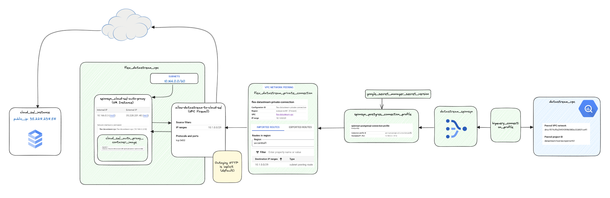

# flex-biqquery-terraform

Terraform-konfigurasjon for å flytte data fra [Google Cloud SQL](https://cloud.google.com/sql) databaser til [Google BigQuery](https://cloud.google.com/bigquery) med [Google Datastream (Change Data Capture)](https://cloud.google.com/datastream).

Repoet er spesifikk for Team Flex i NAV PO Helse, men har flere [moduler](https://github.com/navikt/flex-bigquery-terraform/tree/main/modules) som kan gjenbrukes utenfor NAV med ingen eller mindre modifikasjoner.

Bakgrunnen for oppsettet er at Team Flex ønsker å kunne bruke BigQuery som datakilde for analyse, visualisering og overvåkning av dataintegritet på tvers av databaser.

Datastream er valgt på grunn av at data blir streamet til BigQuery så fort de blir skrevet til eller endret i kildedatabasen. Alternativet er
[federated queries](https://cloud.google.com/bigquery/docs/cloud-sql-federated-queries), som typisk flytter data definert i en SQL-spørring ved angitte intervaller.

Begrunnelsen for bruk av Terraform er todelt. Først og fremst gir det teamet en deterministisk måte å opprette og slette ressurser på. For det andre fungerer konfigurasjonen fungerer som dokumentasjon på hvilke ressurser som er opprettet.

Et alternativ til dette er [nada-datasteram](https://github.com/navikt/nada-datastream), som gjør samme nytte men med en annen tilnærming.

## Arkitektur

Diagrammet beskriver ressursene som settes opp når det opprettet en [Google Datastream](https://cloud.google.com/datastream/docs/overview).



## Innhold

Terraform parser og samler alle .tf-filene i ett prosjekt til én samlet konfigurasjon. Det gjør at man kan fordele ressurser på flere filer uten at det påvirker funksjonalitete. Ved å dele opp ressursene i flere filer kan man organisere konfigurasjonen på en mer strukturert måte, noe som gjør det enklere å finne og vedlikeholde spesifikke ressurser.

Ressursene i dette prosjekter er delt opp i følgende filer:

- `main.tf`: Definerer fellesressurser for prosjektet.
- `variables.tf`: Definerer input-variabler og default-verdier brukt i prosjektet.
- `secrets.tf`: Definerer `data`-ressursers som henter data fra Google Secret Manager.
- `external-connection.tf`: Definerer ressurser brukt til å hentet data fra Cloud SQL-instanser direkte fra Google BigQuery.
- `flex-dataset.tf`: Definerer et Google BiqQuery datasett med tilhørende tilgangskontroll som er ment å tilby views brukt som dataprodukt i [Datamarkedsplassen](https://data.ansatt.nav.no/).
- `soda-dataset.tf`: Definerer et Google BigQuery datasett og views brukt til overbåkning og avstemming av data med Soda. Henter både data fra datasett opprettet av Datastreams og fra Cloud SQL-instanser ved hjelp av _external connections_.
- `datastream-vpc.tf`: Definerer felles ressursers brukt av flere Datastreams.
- `datastream.tf`: Definerer Google Datastreams som skal settes opp. Bruker modulen `flex-bigquery-datastream`.
- `tabeller-<applikasjon>.tf`: For eksempel `tabeller-sykepengesoknad.tf` - Definerer Tabeller views i `flex-dataset` som henter data fra datasett opprettet av datastreamen for den respektive applikasjonen.
- `views-<applikasjon>.tf`: For eksempel `views-spinnsyn.tf` - Definerer BigQuery views i `flex-dataset` som henter data fra datasett opprettet av datastreamen for den respektive applikasjonen.

## Kommandoer

Eksemplene bruker ressurser relatert til `spinnsyn-datastream` som eksempel.

List Datastreams med tilhørende status:

```sh
gcloud datastream streams list --location=europe-north1 --project=flex-prod-af40 | tr -s ' ' | cut -d ' '  -f1,2
```

Stopp en Datastream:

```sh
gcloud datastream streams update spinnsyn-datastream  --project=flex-prod-af40  --location=europe-north1 --update-mask=state --state=PAUSED
```

Start en Datastream:

```sh
gcloud datastream streams update spinnsyn-datastream  --project=flex-prod-af40  --location=europe-north1 --update-mask=state --state=STARTED
```

Hvis en Datastream stopper opp _kan_ det være fordi VM-instansen som kjører Cloud SQL AUth Proxy for den aktuelle applikasjonen trenger å resettes. Det skjer gjerne hvis maskinen har for lite minne. Datastreamen vil starte igjen av seg selv etter en reset.

```sh
gcloud compute instances reset spinnsyn-cloud-sql-auth-proxy --zone=europe-north1-a --flex-prod-af40
```

Slett BigQuery tabell:

```sh
bq rm -t flex-prod-af40:spinnsyn_datastream.public_utbetaling
```

## BigQuery Clustering

_Partitioning_ er når en tabell deles inn i mindre deler basert på en bestemt kolonne, vanligvis en tidskolonne. Dette forbedrer ytelsen og redusere kostnader ved spørringer, da bare relevante partisjoner blir skannet i stedet for hele tabellen.

 _Clustering_ i BigQuery er når dataene innenfor en partisjon sorteres basert på en eller flere kolonner for å ytterlligere forbedrer ytelsen.

Datastreams oppretter automatisk tabeller, men kan også skrive til ekisterende tabeller. Hvis man vil skrive til en BigQuery-tabeller som er clustret eller partisjonert må tabellen opprettes separat. Se Terraform-ressursen [google_bigquery_table](https://registry.terraform.io/providers/hashicorp/google/latest/docs/resources/bigquery_table).
